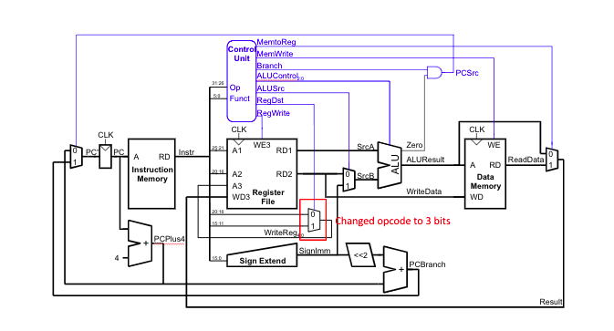
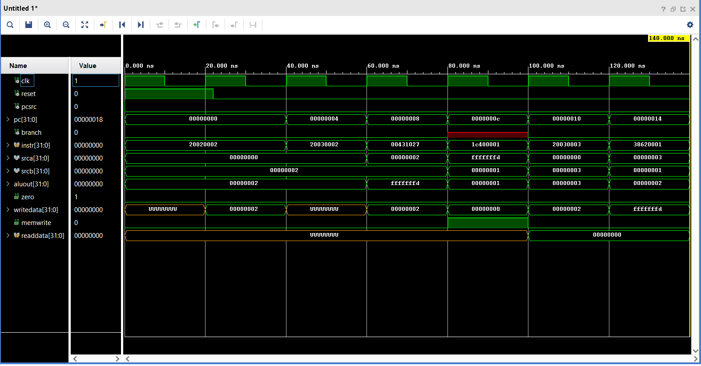

# Computer Architecture

## MIPS 3 Group Project - Modifying the VHDL for the MIPS 3 Single Cycle Processor 

### MIPS 3 Overview
The learning goals for the MIPS 3 group project are as follows:

* Learn how the VHDL hardware for a MIPS single cycle processor works
* Learn how to implement new instructions for the MIPS single cyle processor

### Grade Break Down
| Part                               |   | Points  |
|------------------------------------|---|---------|
| MIPS_3 a - Add XORI, BGTZ and one more instruction of choice.       |   | 30 pts  |   
| MIPS_3 b - Mini Presentation       |   | 20 pts  |    
| Total                              |   | 50 pts  |

# Introduction
In this lab you will (as a group) expand the MIPS single-cycle processor design using VHDL. 
* You will load a test program and check that the instructions work in both the simulator and on a FPGA.  
* Next, you will implement three new MIPS instructions, XORI, BGTZ, and an instruction that the group chooses from Appendix B of your textbook. You will then write a new test program that confirms the three new MIPS instructions work. 
* In order to implement three new instructions you likely will need to make changes to the hardware for the processor.  
* By the end of this lab, you should have a much better understanding the internal operation of the MIPS single-cycle processor.
* _Please read and follow the instructions in this lab carefully.  In the past, many students have lost points for silly errors like failing to include screen snips of the simulation signal traces requested in the lab._

As a group you must work on this part of the project together (on discord or using liveshare).
Make sure that each of you in your group have roughly equal time "driving" while the others looks for errors, discusses the process etc.

As a group refresh your memory of this paper: https://collaboration.csc.ncsu.edu/laurie/Papers/Kindergarten.PDF  
* Share everything – work together at the same terminal and not separately.
* Play fair – don’t do all the work by yourself, OR hog the computer when typing.
* Don’t hit you partner – make sure to share tasks so one partner is not tempted to browse the web, text, etc. Give you partner the benefit of the doubt but also encourage them to contribute.
* Put things back where you found them – put away negative thoughts and don’t dwell on them. Focus on the positives.
* Clean up your own mess – pair programming will help you catch mistakes early and often.
* Don’t take things too seriously – have fun and be proactive.

# MIPS_3 a - Add XORI, BGTZ, and an instruction of your choice to MIPS

## _Step 1:_ Modify the hardware design (if neccessary) to support the three new instructions XORI, BGTZ, and instruction of choice
Modify the following schematic (if neccessary). This jpg was made from the ```schematic.pptx``` file located in this folder. If you need to modify it in order to support the instructions, you can edit this PowerPoint slide. Once you have modified the slide, you can export it as a jpg into this folder and save it over the existing ```schematic.jpg```. Your changes should then become apparent in this document.  I recommend drawing any new signal wires or components in a different color than black or blue.



## _Step 2:_ Control Unit Modifications

Modify the tables below for the ```main decoder``` and the ```ALU decoder```, as needed, in order to account for XORI, BGTZ and your new instruction. You may or may not need to add more control signals.

| **Instruction** | **Op[5:0]** | **RegWrite** | **RegDst** | **AluSrc** | **Branch** | **MemWrite** | **MemtoReg** | **ALUOp[1:0] **|** Jump** |
| --------------- | ----------- | ------------ | ---------- | ---------- | ---------- | ------------ | ------------ | -------------- | -------- |
| R-type          | 000000      | 1            | 1          | 0          | 0          | 0            | 0            | 10             | 0        |
| lw              | 100011      | 1            | 0          | 1          | 0          | 0            | 1            | 00             | 0        |
| sw              | 101011      | 0            | X          | 1          | 0          | 1            | X            | 00             | 0        |
| beq             | 000100      | 0            | X          | 0          | 1          | 0            | X            | 01             | 0        |
| addi            | 001000      | 1            | 0          | 1          | 0          | 0            | 0            | 00             | 0        |
| j               | 000010      | 0            | X          | X          | X          | 0            | X            | XX             | 1        |
| xori            | 001110      | 1            | 0          | 1          | 0          | 0            | 0            | 110            | 0        |
| bgtz            | 000111      | 0            | X          | X          | X          | 1            | 1            | 011            | 0        |
| nor             | 000000      | 1            | 0          | 1          | 0          | 0            | 0            | 100            | 0        |

You may or may not need to add extra ALUOp signals:

| **ALUOp[2:0]**|** Meaning** |
| ------------- | ----------- |
| 00X           | Add         |
| 101           | Addi        |
| 010           | Sub         |
| 110           | Xori        |
| 011           | Bgtz        |

## _Step 3:_ Implement Changes in VHDL

Next, modify the VHDL code in this project to implement your hardware design given above. Make sure to push the changes to your group folder!

## _Step 4:_ Assembly Language Test Program for your modified MIPS single-cycle processor

For this part your group will create an assembly language test program (```test_3.s```) for the modified MIPS processor that uses all three of the new instructions.
* You may if you wish add more instructions, but, you are not required to at this time. 
* You may also if you wish modify the I/O for the processor, but, you are not required to at this time.

Put the mips assemly language code for your program here (make sure it uses all three of the new instructions):
   
   ```asm
    # test_3.s MIPS Assembly Language Test Program to Test 3 newly implemented instructions

    main:
      addi $2, $0, 2
      addi $3, $0, 2
      # Comment out line 6 to test bgtz
      nor $2, $2, $3
      bgtz $2, end
      addi $3, $0, 3
    end:xori $2, $3, 1 
   ```


## _Step 5:_  Translate to Machine Code
Translate your assembly language program to machine code. Create a hex machine code file named ```memfile_3.dat``` that will contain the "assembled" program. You will need to modify the VHDL impure function code that load the machine code instructions. You will need to modify it to load ```memfile_3.dat```. 

Also, include the hexcode directly here:

  Hex Code for the test program
  ```
  20020002
  20030002
  00431027
  1c400001
  20030003
  38620001
  ```

  NOTE: You may if you wish use PCSpim to generate part of the machine code for ```memfile_3.dat``` from the file ```test_3.s```. Remember that QTSpim will NOT give you the correct machine code for any of the jump or branching statements in your program! 
  
  The generated instruction machine code for jumps and branches may differ from what is needed for your machine. For example:
  * Our machine code starts the text segment at address ```0x00000000``` instead of ```0x00400000``` 
  * Our memory starts at address ```0x00000000``` in data memory rather than ```0x10000000```. 
  
  You will need to figure out how to generate the correct the machine code instructions so that the code works on our mips machine!

## _Step 6:_  Simulation of the Test Program
Generate a simulation waveform that shows that your group's test program is running correctly on the MIPS simulator. You must use the following signals in your simulation waveform trace:

  ```
  clk, reset, pcsrc, pc, branch, instr, srca, srcb, aluout, zero, writedata, memwrite, readdata 
  ```
  
  
  Include these signlas in that **exact** order! Make sure all your waveforms are readable and show values in hexadecimal. Take enough screen shots of the simulation trace (as you did before) and include them in this document directly here to demonstrate that your code is working. Make sure the waveforms are readable:

  ### Simulation Waveform Images


## _Step 7:_ Running the MIPS Test program on the FPGA

Make sure your ```test_3``` program can run successfully on the FPGA. Remember the clock on the FPGA has been slowed down in order to verify that the program works correctly. 

## Summary of Deliverable in this Project Folder

Please submit each of the following items, clearly labeled and in the following order:

1. This entire document with the entries filled out as requested in this document.
2. The modified **vhdl** and **dat** files for the exercises as described above.
3. Follow instructions **carefully** for the simulation waveforms and tables. 
   
Because of the high standards we have for our Whitworth students, we want you to do this correctly. For the waveforms, you will need to take multiple screen shots of the simulation trace and include them in this document as required.

# MIPS_3 b - Mini Presentation 

On the due date for this design, groups will take 5 minutes (max) and present their hardware design and test algorithm to the class. Your group will be graded on whether you present the following items. **Do not use more than 4 or 5 slides to summarize your project.**

* **Minute 1**: What hardware changes did you make to MIPS to accommodate XORI and BGTZ? Show a diagram of the changes. 
  
* **Minute 2**: Show the corresponding VHDL changes for the hardware changes that were made.

* **Minute 3**: A neat assembly language listing of your MIPS test program. You must include comments.

* **Minute 4**: An image (or video) of yuour program running on the FPGA.

* **Minute 5**: A discussion of the process and result. 
  - What went well? What not so well?
  - Did you get both simulation and FPGA working?
  - Did you do anything above and beyond the requirements (not required)?
