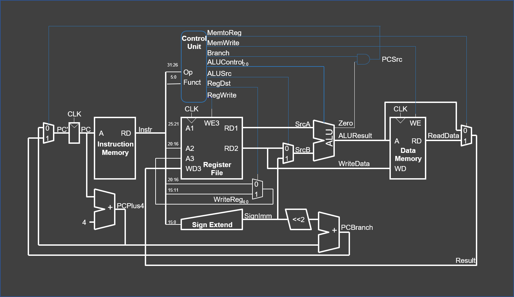
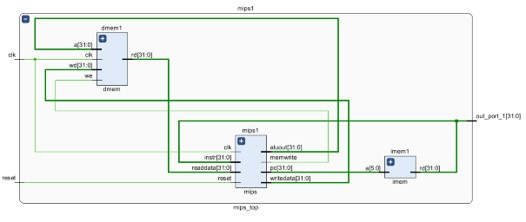
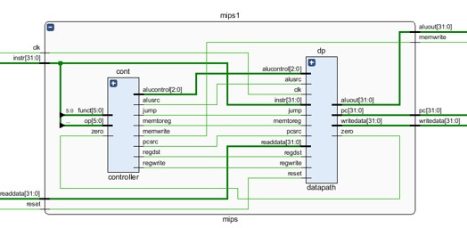
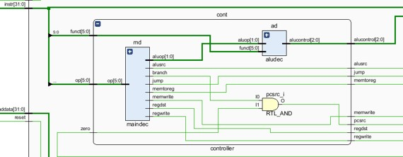
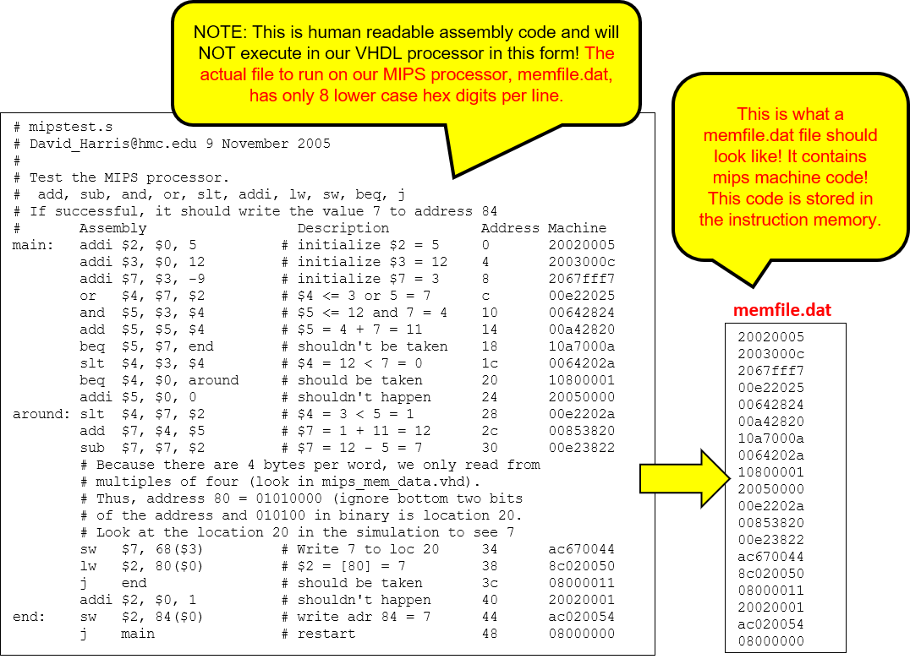
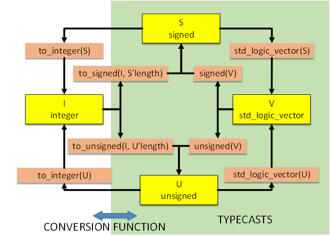
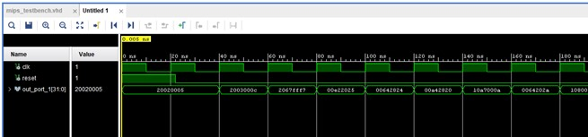
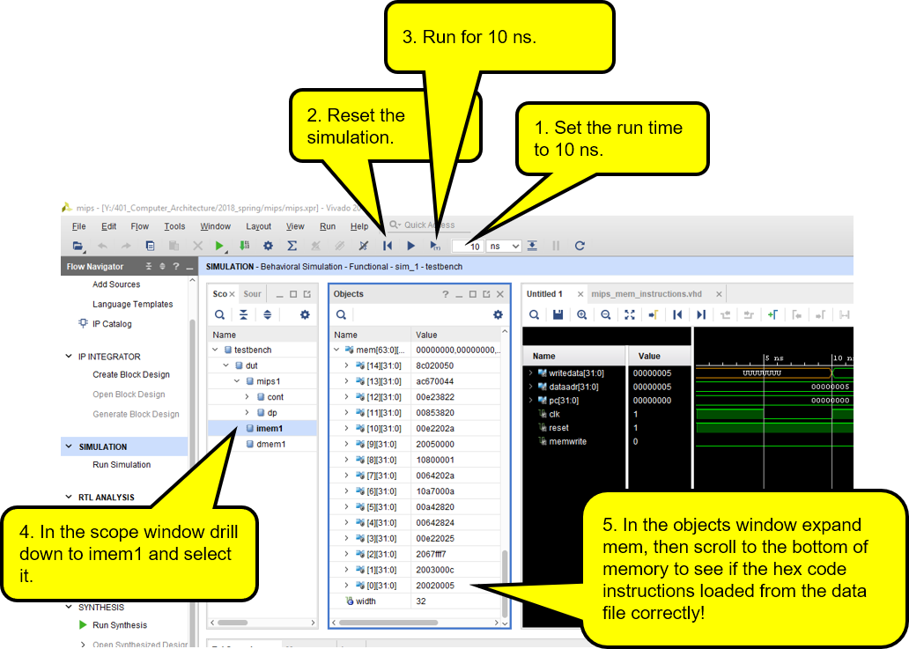
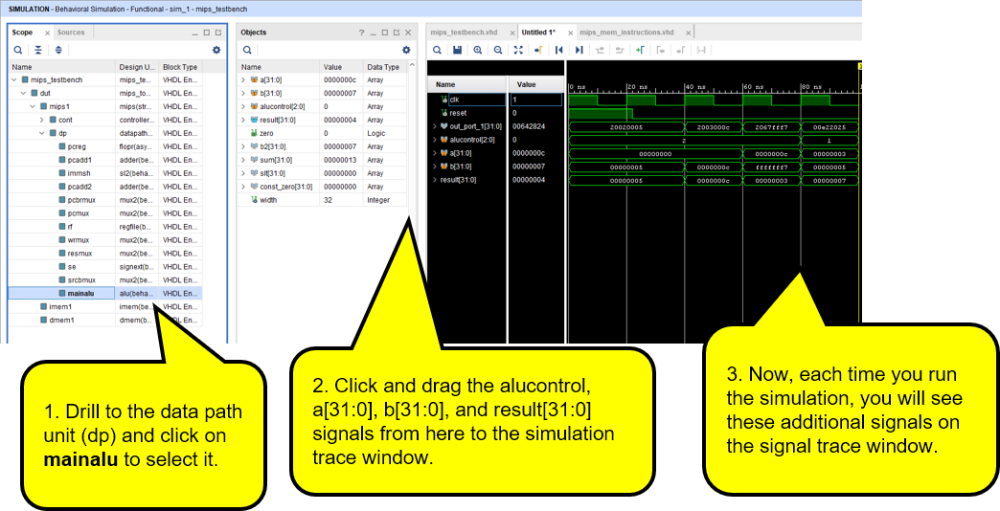

# Computer Architecture
## MIPS 3 - VHDL MIPS Single Cycle Processor - Individual Assignment

### MIPS 3 Overview
* Fill in the answers to the questions in this document and submit it back to your whitgit folder
* Learn how the VHDL hardware for a MIPS single cycle processor works
* Learn how to implement new instructions for the MIPS single cyle processor

### Grade Break Down
| Part                                              |   | Points  |
|---------------------------------------------------|---|---------|
| MIPS_3-1 - Change MIPS Program (Individual)       |   | 20 pts  |    
| MIPS_3-2 - Compare Sim to Prediction (Individual) |   | 20 pts  |   
| MIPS_3-3 - Run MIPS on BASYS 3 (Individual)       |   | 10 pts  |   
| Total                                             |   | 50 pts  |

NOTE: The MIPS_3 group project will be graded separately and will be worth 50 points as well. 


# Introduction
In this lab you will expand the MIPS single-cycle processor using VHDL. You will also turn in this document on blackboard with your answers pasted into the document. Each individual will turn in the document separately.
* You will load a test program and check that the instructions work in both the simulator and on a FPGA.  
* Next, you will implement two new MIPS instructions, XORI and BNE. You will then write a new test program that confirms the new MIPS instructions work. In order to implement BNE you will have to make changes to the VHDL for the processor.  
* By the end of this lab, you should understand the internal operation of the MIPS single-cycle processor.
* _Please read and follow the instructions in this lab carefully.  In the past, many students have lost points for silly errors like failing to include screen snips of the simulation signal traces requested in the lab._

# MIPS Single-Cycle Processor
Before starting this lab, you should review the single-cycle implementation of the MIPS processor described in Section 7.3 of your text, covered in class lectures and supplied in this folder. The single-cycle processor schematic from the text is repeated here for your convenience:




This version of the MIPS single-cycle processor can execute the following instructions:  
```
add, addi, and, beq, j, lw, or, slt, sub, and sw
```

The VHDL for the single-cycle MIPS entity is given in Section 7.6.1 of the text and also in this project folder.  Although the VHDL in the text is very close to being correct, there have been changes made to the code so that it will work for both synthesis and simulation.  The most significant changes to the code are in the way the initial program loads into the FPGA’s internal RAM as we covered in class.


# Steps to Generate the MIPS Simulation and MIPS bitstream

1. At the bash terminal in vscode run the ./gen.sh command to generate the vivado simulation and bitstream.
2. Open the ./generated/ subfolder and find the ```MIPS_3_INDIVIDUAL.xpr``` file. Double-click on this file to open the generated project in vivado.

# Organization of MIPS 3

The highest-level entity for the mips processor itself is called mips_top, it contains the instruction memories and data memories and the processor itself.  Each of the memories is a 64-word × 32-bit array. The instruction memory needs to contain some initial values that represent the program to execute.  Go ahead an open the elaborated design then double click on the mips1 component. It should look like the following image at the top level.  



Notice that there is a data memory (dmem1), an instruction memory (imem1) and a mips processor (mips1). These are drawn in reverse order by Vivado (reverse from our original schematic) since mips also wires the output of _imem_ to the input of the hex display. The output of imem (carries the instruction read from imem) on a data bus that wraps back around and feeds into the instruction input of mips1.  Sadly, Vivado also draws the data memory on the left side of the image rather than the right. 

Now, expand the mips1 component. YHou should see this:




Our architecture for the single-cycle MIPS processor divides the machine into two major components: 

1. The control unit (cont) and 
2. The datapath unit (dp)

Each of these major components is constructed hierarchically from various structural blocks.  For example, as shown in the first figure in this document, the datapath contains the 32-bit ALU, the register file, the sign extension logic, and five multiplexers that route data signals through the data path unit.

# The MIPS Control Unit

Go ahead and take a look at the _controller_ entity and it's components:



The controller contains two main components:
* Main decoder (md) this entity produces all control signals except those for the ALU.  
* ALU decoder (ad) This entity produces the controls signals, alucontrol[2:0], for the ALU.  
  
Make sure you thoroughly understand how the controller entity operates.  **Find and match the signal names given in the VHDL code for the control unit's port with the wires shown on the mips schematic (see the first MIPS schematic).**

Finally, take a look at the **datapath (dp)** VHDL entity.  The datapath has a lot of components.  You may find it easier look at the schematic given at the start of this document than at the elaborated design in Vivado, however, you still should be able to locate the same signals in both renderings.  

Make sure you understand the role of each component in the datapath unit, and where it resides on the MIPS single-cycle processor hardware schematic.  
# 
# Initial Test Program
# 

The MIPS project comes with the instruction memory preloaded with a memfile.dat that is contains the machine code for the following assembly language program called mipstest.asm.  
```
NOTE: This is very important to understand. The test program stored in memfile.dat has ONLY 8 digits per line. Each line consists of a hex number that can only contain digits and the lower case letters a,b,c,d,e,f.  In the future, when writing your own program, DO NOT put anything other than exactly 8 lower case hex digits on a line. If you don’t follow these rules, your program will not work and you may become confused as to why things won’t work correctly.
```

The current simulation project automatically reads and loads the machine code from the memfile.dat into the MIPS instruction memory **during the synthesis process**.  This allows students to run small programs directly on the FPGA without requiring them to implement a complex SDRAM interface.  The current code is stored in an array of STD_LOGIC_VECTOR that forms the instruction memory for the machine.  
 


# The Memory Model Used for the MIPS 3 VHDL Processor
Because this simple mips processor was designed to run entirely on a single FPGA, we have used an extremely simple memory model for both the instruction memory and the data memory. 

The first instruction memory location starts at address 0x00000000. The same is true for the data memory. This differs from the actual MIPS architecture where the first instructions typically start at address 0x00400000. In the future, if you are able to integrate a memory controller into your processor you may wish to change this.    

# How the HEX Code Machine Language Program is loaded at Synthesis Time

To understand how loading hex code from memfile.dat into memory works, you need to examine the code in the ```mips_mem_instructions.vhd``` file  (double-click on the **imem** component in our VHDL project). The instruction memory consists of an array of 64 locations, each of which can store 32 bits. In this file we first define a hardware data type called ramtype:

```vhdl
   type ramtype is array (63 downto 0) of STD_LOGIC_VECTOR(31 downto 0);
```

We then use this data type to initialize the ram array object during synthesis as follows:

```vhdl
  -- use the impure function to read RAM from a file and 
  -- store in the FPGA's ram memory
  signal mem: ramtype := InitRamFromFile("memfile_2.dat");
```
The function,  ```InitRamFromFile("memfile.dat")``` returns a RAM array to initialize the signal ```mem```. It does this by reading the data file ```memfile.dat```. The function creates 32 bit words in the mem array by reading one character at a time from the memfile.dat file. Each character represents a 4 bit hexadecimal value and after reading, is converted to a four bit integer. Each 4 bit integer is shifted into its correct position and added to a temporary result.  After constructing an entire temporary result (a 32 bit word) for each instruction, the code writes that instruction to the next instruction memory location in the RAM. After being initialized, the RAM is returned to initialize the ```mem```. Here is the code to initialize the instruction memory:

```vhdl
  -- function to initialize the instruction memory from a data file
  impure function InitRamFromFile ( RamFileName : in string ) return RamType is
  variable ch: character;
  variable index : integer;
  variable result: signed((width-1) downto 0);
  variable tmpResult: signed(63 downto 0);
  file mem_file: TEXT is in RamFileName;
  variable L: line;
  variable RAM : ramtype;
  begin
    -- initialize memory from a file
    for i in 0 to 63 loop -- set all contents low
      RAM(i) := std_logic_vector(to_unsigned(0, width));
    end loop;
    index := 0;
    while not endfile(mem_file) loop
      -- read the next line from the file
      readline(mem_file, L);
      result := to_signed(0,width);
      for i in 1 to 8 loop
        -- read character from the line just read
        read(L, ch);
        --  convert character to a binary value from a hex value
        if '0' <= ch and ch <= '9' then
          tmpResult := result*16 + character'pos(ch) - character'pos('0') ;
          result := tmpResult(31 downto 0);
        elsif 'a' <= ch and ch <= 'f' then
          tmpResult := result*16 + character'pos(ch) - character'pos('a')+10 ;
          result := tmpResult(31 downto 0);
        else report "Format error on line " & integer'image(index)
          severity error;
        end if;
      end loop;
      -- set the width bit binary value in ram
      RAM(index) := std_logic_vector(result);
      index := index + 1;
    end loop;
    -- return the array of instructions loaded in RAM
    return RAM;
  end function;
```

# Vivado Tips: Missing Files
* Sometimes files may end up “missing” in Vivado and you need to remove them from your project. 
* If this happens to you, right click on the hierachy and try to refresh it. 

# VHDL Data Conversion Tips
* When you examine the code, you will notice the various data type conversions and typecasts. 
* The next figure demonstrates how to convert (and typecast) between various data types in VHDL.



# VHDL Test Bench Simulation

Inspect the testbench code: ```./sim_testbench/mips_testbench.vhd``` This is for simulation testing only and cannot be synthesized into hardware. It generates a simulated clock input and a simulated reset input for the device under test, ```mips_top```.  

1. Now run the simulation using vivado.  
2. Find Simulation Sources, browses to ```mips_testbench```, select it, and then run the Simulation. 
3. If you zoom the output window as shown below you should be able to verify the hex codes of the instructions as they are read from memory and displayed on the output port (that would connect to a hex display on the BASYS 3 board). 
4. Remember that the program has a "jump to main" at the end of the program and thus will continue to repeat over and over.   



# Use Vivado to Inspect the MIPS Instruction Memory

To verify that the correct hex machine code program was loaded into memory you should inspect the mips ```imem1``` memory in the simulator.  This should be one of the first things you do if you change the "program" you want to run on the VHDL processor.

### Steps to Inspect MIPS Memory
1. Start the Vivado simulator test bench.
2. At the top of te simulator window, set the run time to 10 ns.
3. Reset the simulation.
4. Run for 10 ns.
5. Use the *Scope* window of the Vivado simulator to drill down to the the ```imem1`` component and click to select it.
6. In the *Objects* windows, expand the ```mem`` object. Scroll to the bottom of the memory to see that your hex instructions were loaded correctly from the data file!
7. Don't forget that the instructions will start at 0 and proceed upwards in memory.



### Steps to Check Other Signals During Simulation
Start the Vivado simulator test bench then proceed as follows:
1. Drill down to the Data Path Unit (DP) and click on ```mainalu``` to select it.
2. Click and drag each one of ```alucontrol, a[31:0], b[31:0], and result[31:0]``` to the simulation trace window.
3. Now, each time you run the simulation, you will see these additional signals on the signal trace window.
   


# -------------------------------------------------

# Exercise 3-1: Changing the Machine Code Program and Predicting Control Signals

### Steps to Change the Machine Code for MIPS 3 
1. Create a machine code file and add the following machine code to it. I recommed using .dat as the extension. Do not leave any empty lines in the file!
   
    ```memfile_2.dat```
    ```
    20020005
    20070003
    2003000c
    00e22025
    00642824
    00a42820
    10a70008
    0064302a
    10c00001
    2005000a
    00e2302a
    00c53820
    00e23822
    0800000f
    8c070000
    ac470047
    ```
2. Modify ```mips_mem_instructions.vhd``` to load ```memfile_2.dat``` rather than ```memfile.dat```.

```
Look at the assembly language instruction keyword.

Identify the instruction (e.g. addi, sll, sw etc...)

Look up the associated code for the instruction in the appendix, is it J, R or I type?

Find the associated format. 

Fill out each field of the format based on the arguments to the instruction.
```
Given the following MIPS assembler program, translate each of the given instructions to MIPS machine code in the areas provided. The first one is done for you as an example. Enter your values directly in the tables below.

```mips
 addi $s0, $0, 22    	# $s0 = 0 + 22 = 22
 addi $s1, $s0, 20    	# $s1 = $s0 + 20 = 42
 sll  $s1, $s1, 2       # $s1 = $s1 << 2
 sw   $s1, 0x10($t2)    # store contents of $s1 to (0x10+$t2)
```

### The first instruction has been assembled for you as follows:

```mips
addi $s0, $0, 22    	# $s0 = 0 + 22 = 22
```

|               | OP    | RS     | RT    | IMM                 |
|---------------|-------|--------|-------|---------------------|
| Field Values  |(8)    | 0      | 16    | 22                  |
| Machine Code  |001000 | 00000  | 10000 | 0000 0000 0001 0110 |
| Size of Field |6 bits	| 5 bits | 5 bits| 16 bits             |
<br>
### 2-1.1 Assemble the following instruction, put your answers in the table below:

```mips
addi $s1, $s0, 20    	# $s1 = $s0 + 20 = 42
```

|               | OP    | RS     | RT    | IMM                 |
|---------------|-------|--------|-------|---------------------|
| Field Values  |       |        |       |                     |
| Machine Code  |       |        |       |                     |
| Size of Field |6 bits	| 5 bits | 5 bits| 16 bits             |
<br>
### 2-1.2 Assemble the following instruction, put your answers in the table below:

```mips
sll  $s1, $s1, 2       # $s1 = $s1 << 2
```

|               | OP    | RS     | RT    | IMM                 |
|---------------|-------|--------|-------|---------------------|
| Field Values  |       |        |       |                     |
| Machine Code  |       |        |       |                     |
| Size of Field |6 bits	| 5 bits | 5 bits| 16 bits             |

<br>
### 2-1.3 Assemble the following instruction, put your answers in the table below:

```mips
sw   $s1, 0x10($t2)    # store contents of $s1 to (0x10+$t2)
```

|               | OP    | RS     | RT    | IMM                 |
|---------------|-------|--------|-------|---------------------|
| Field Values  |       |        |       |                     |
| Machine Code  |       |        |       |                     |
| Size of Field |6 bits	| 5 bits | 5 bits| 16 bits             |


# Exercise 2-2: Little/Big Endian  
<br>

### 2-2-1 Little endian machine: 
* Store the integer 0xA1B2C3D4 in the following memory starting at memory location 0x1000102C. 
* IMPORTANT: Memory locations increase from bottom to top and from left to right... 

| BYTE ADDRESS	| Byte +0	| Byte +1	| Byte +2	| Byte +3 |
|---------------|-----------|-----------|-----------|---------|
| 0x10001034    |           |           |           |         |				
| 0x10001030    |           |           |           |         |				
| 0x1000102C    |           |           |           |         |				
<br>
### 2-2-2 Little endian machine: 
* Store the null terminated string “Endian” in the following memory starting at memory location 0x1000102C. 
* Memory locations increase from bottom to top and from left to right... 

| BYTE ADDRESS	| Byte +0	| Byte +1	| Byte +2	| Byte +3 |
|---------------|-----------|-----------|-----------|---------|
| 0x10001034    |           |           |           |         |				
| 0x10001030    |           |           |           |         |				
| 0x1000102C    |           |           |           |         |				
<br>
### 2-2-3 Big endian machine: 
* Store the integer 0xA1B2C3D4 in the following memory starting at memory location 0x1000102C. 
* Memory locations increase from bottom to top and from left to right... 

| BYTE ADDRESS	| Byte +0	| Byte +1	| Byte +2	| Byte +3 |
|---------------|-----------|-----------|-----------|---------|
| 0x10001034    |           |           |           |         |				
| 0x10001030    |           |           |           |         |				
| 0x1000102C    |           |           |           |         |				
<br>
### 2-2-4 Big endian machine: 
* Store the null terminated string “Endian” in the following memory starting at memory location 0x1000102C. 
* Memory locations increase from bottom to top and from left to right... 


| BYTE ADDRESS	| Byte +0	| Byte +1	| Byte +2	| Byte +3 |
|---------------|-----------|-----------|-----------|---------|
| 0x10001034    |           |           |           |         |				
| 0x10001030    |           |           |           |         |				
| 0x1000102C    |           |           |           |         |

# Exercise 2-3: Dissassembling MIPS 

Dissasembly is the process of taking a machine code program that is listed using 32 bit hex value, and determining the corresponding MIPS assembly language instruction for the machine code program.

#### Dissasembly Process
```
Translate each HEX instruction to a 32 bit binary value.
Identify the OPCODE field of that instruction.
Look at the binary value of the OPCODE

if OPCODE is all zeros
    You have an R-type instruction
    For the R-type instruction look at the FUNCT field to determine the instruction
else
    You have a J or I type instruction

Lookup the OPCODE (or FUNCT) in the Appendix of your book to determine instruction.

Repeat the process for the other instructions.
```

#### Graphic of the Dissasembly Process


Consider the following program. Convert it from MIPS machine code to assembler using Appendix B of your textbook. 

```
 ADDRESS   MACHINE CODE
[0040002c] 20100000  
[00400030] 2011000a
[00400034] 02118020  
[00400038] 2231ffff  
[0040003c] 1e20fffe  
```

You should be aware that this code was assembled using QTSPIM, and thus, 
* The immediate value of the last instruction is sign extended and shifted left two places. 
* QTSPIM adds this value TO THE CURRENT PC (0040003c) and NOT to PC+4 (00400040) as our book describes. 
* Thus, the target address of the last instruction will (in QTSPIM) be 00400034.  
* This is how you should interpret this algorithm to work for this exercise. 
* This unfortunately does not agree with the book which claims the offset should be added to (PC+4) and does not match with how the book's MIPS processor works. 

### 2-3-1 Write the MIPS Assembly language for the above program below in the space provided:

```mips
# Put your mips assembly language code immediately after this line


```


### 2-3-1 Write code for a C++ program snippet (you don't need an entire C++ program, just the corresponding statements) that does exactly the same thing below in the space provided

```cpp
// Put your C++ code after this line:


```

